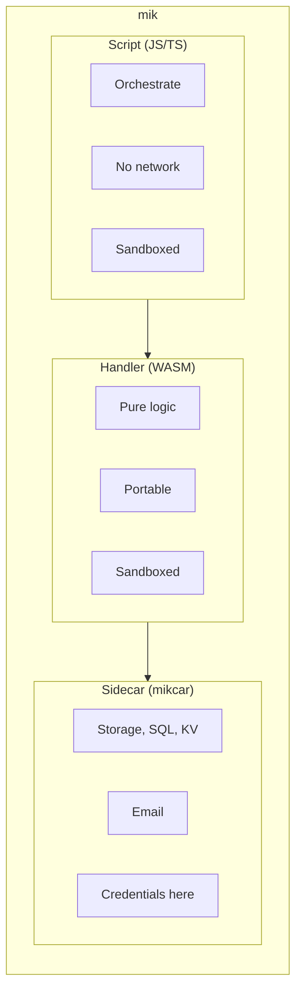
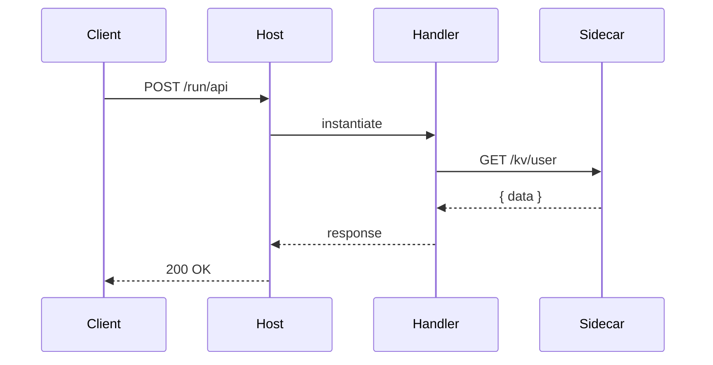
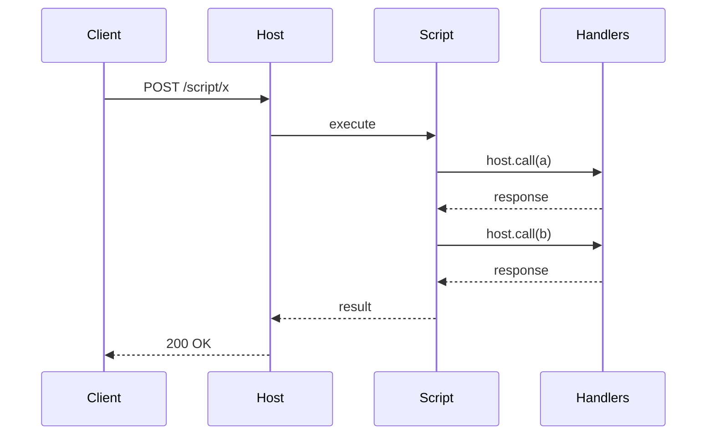
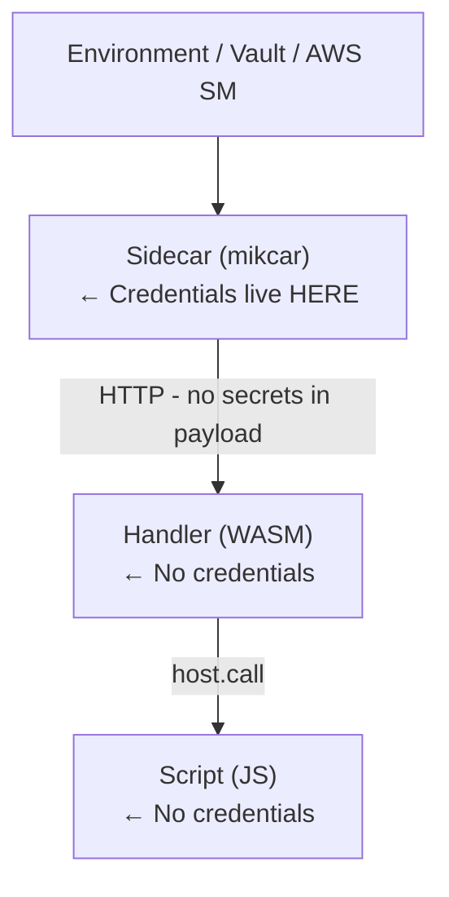

# mik Architecture

## Overview

mik implements a **layered capability model** for running portable WASM HTTP handlers with infrastructure sidecars.



---

## The Three Layers

### Layer 1: Scripts (Orchestration)

**Purpose**: Compose multiple handlers into workflows

**Capabilities**:
- `host.call(handler, options)` - Call WASM handlers
- JSON processing
- Control flow

**Restrictions**:
- No network access (no `fetch`)
- No filesystem
- No imports/require
- No shell execution

**Security**: Scripts can only orchestrate, never exfiltrate data.

```javascript
// scripts/checkout.js
export default function(input) {
    var auth = host.call("auth", { path: "/verify", body: { token: input.token } });
    if (auth.status !== 200) return { error: "Unauthorized", status: 401 };

    var order = host.call("orders", { path: "/create", body: input });
    host.call("notifications", { path: "/send", body: { order_id: order.body.id } });

    return order.body;
}
```

### Layer 2: Handlers (Business Logic)

**Purpose**: Implement business logic in portable WASM

**Capabilities**:
- HTTP client (via `mik_sdk::http_client`)
- JSON/data processing
- Computation

**Restrictions**:
- No direct database access
- No filesystem
- No credentials/secrets access
- Must call sidecars for I/O

**Security**: Handlers are sandboxed WASM - memory-safe, isolated.

**Portability**: Handlers export `wasi:http/incoming-handler` and can run on any WASI Preview 2 HTTP runtime.

### Layer 3: Sidecars (Infrastructure)

**Purpose**: Bridge to external infrastructure

**Capabilities**:
- Full network access
- Credential management
- Native performance
- Database connections
- External APIs

**Current mikcar services**:

| Service     | Backends                   | API                                       |
| ----------- | -------------------------- | ----------------------------------------- |
| **Storage** | Local FS, S3               | `/upload`, `/download`, `/delete`         |
| **SQL**     | SQLite, PostgreSQL         | `/query`, `/execute`, `/transaction`      |
| **KV**      | In-memory, Redis           | `/get`, `/set`, `/delete`, `/list`        |
| **Email**   | SMTP, Resend, SES          | `/send`                                   |

---

## Data Flow Examples

### Synchronous Request



### Script Orchestration



---

## Security Model

### Capability Matrix

| Layer   | Network   | Filesystem | Credentials | Database    |
| ------- | --------- | ---------- | ----------- | ----------- |
| Script  | -         | -          | -           | -           |
| Handler | HTTP only | -          | -           | via sidecar |
| Sidecar | Full      | Configured | Yes         | Direct      |

### Blast Radius Containment

| Bug Location | Impact |
|--------------|--------|
| Script bug | Can't leak data (no network access) |
| Handler bug | Can't access DB directly (no credentials) |
| Sidecar bug | Isolated process (doesn't crash runtime) |

### Credential Flow



---

## Why This Architecture?

### 1. Defense in Depth

Each layer has minimal permissions. A vulnerability in one layer can't compromise the others.

### 2. Portability

Handlers are standard WASI HTTP components. They work on any WASI Preview 2 runtime - no vendor lock-in.

### 3. Independent Scaling

| Scenario | Solution |
|----------|----------|
| High traffic | Scale handlers (stateless, cheap) |
| Database pressure | Scale/upgrade sidecars |
| Complex workflows | Scripts are very cheap |

### 4. Testability

| Test Type | Approach |
|-----------|----------|
| Unit test handlers | Mock sidecar responses |
| Unit test scripts | Mock handler responses |
| Integration test | Real sidecars, test handlers |

### 5. Clear Boundaries

- **Scripts**: "What to call and in what order"
- **Handlers**: "What to compute"
- **Sidecars**: "How to persist/communicate"

---

## Comparison to Industry

| Platform           | Similar Pattern                           |
| ------------------ | ----------------------------------------- |
| Cloudflare Workers | Isolated handlers + bindings (KV, R2, D1) |
| Fastly Compute     | WASM + capability-based backends          |
| Dapr               | Sidecar for state/pubsub/secrets          |
| Temporal           | Orchestration + isolated workers          |

This architecture follows established patterns from:
- Capability-based security (Principle of Least Privilege)
- Sidecar pattern (Kubernetes, service mesh)
- Actor model (Erlang, Akka)

---

## Current Capabilities

### Implemented

| Category          | Feature                       | Status |
| ----------------- | ----------------------------- | ------ |
| **HTTP**          | Incoming handlers             | ✅      |
| **HTTP**          | Outgoing requests (handlers)  | ✅      |
| **Orchestration** | JS scripts                    | ✅      |
| **Storage**       | File storage (S3, local)      | ✅      |
| **Database**      | SQL (SQLite, Postgres)        | ✅      |
| **Cache**         | KV store (Redis, memory)      | ✅      |
| **Email**         | Transactional email           | ✅      |
| **Reliability**   | Circuit breaker               | ✅      |
| **Reliability**   | Graceful shutdown             | ✅      |

### Future Considerations

| Category     | Feature               | Notes                       |
| ------------ | --------------------- | --------------------------- |
| **Compute**  | CPU-intensive sidecar | For parallel workloads      |
| **Events**   | Webhook ingestion     | Receive external events     |
| **Schedule** | Cron jobs             | Scheduled handler execution |
| **Auth**     | Auth middleware       | JWT/OAuth at host level     |

---

## References

- [WASI HTTP Proxy](https://github.com/WebAssembly/wasi-http)
- [wasmtime Documentation](https://docs.wasmtime.dev/) - Core WASM runtime
- [Dapr Sidecar Pattern](https://docs.dapr.io/concepts/dapr-services/sidecar/)
- [Cloudflare Workers Bindings](https://developers.cloudflare.com/workers/runtime-apis/bindings/)
