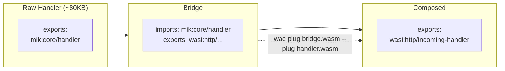
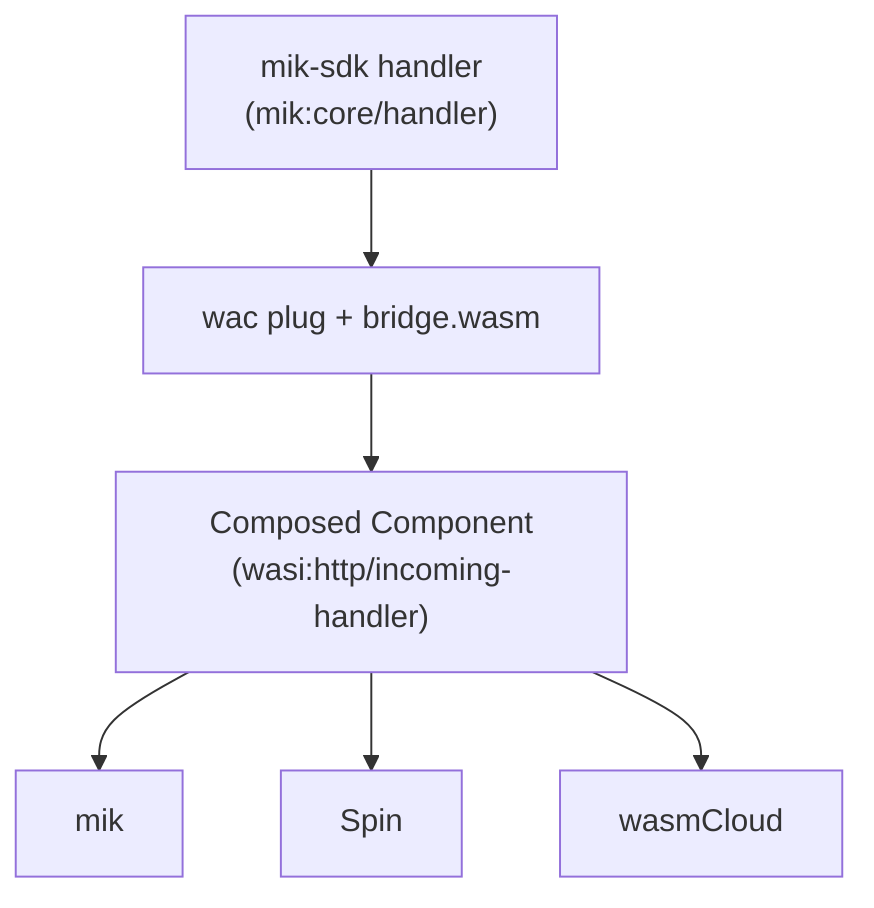

# ADR-003: Bridge Composition for Handler Portability

**Status:** Accepted
**Date:** 2025-12-27
**Decision Makers:** Project maintainer
**Context:** Handler interface design and WASI HTTP compatibility

---

## Summary

mik-sdk handlers export `mik:core/handler` (ergonomic interface) and are composed with a bridge component to produce `wasi:http/incoming-handler` (standard interface) for runtime compatibility.

---

## Context

The WASI HTTP standard defines `wasi:http/incoming-handler` as the interface for HTTP request handling:

```wit
// wasi:http/incoming-handler@0.2.0
interface incoming-handler {
    handle: func(request: incoming-request, response-out: response-outparam);
}
```

This interface is:
- **Streaming-oriented**: Uses `incoming-body`, `outgoing-body` streams
- **Resource-based**: `incoming-request` and `response-outparam` are resources
- **Low-level**: Requires manual header iteration, body streaming, etc.

For most HTTP handlers, this is unnecessarily complex:

```rust
// Raw wasi:http usage - verbose
fn handle(request: IncomingRequest, response_out: ResponseOutparam) {
    let headers = request.headers();
    let method = request.method();
    let path = request.path_with_query().unwrap_or_default();

    let body = request.consume().unwrap();
    let stream = body.stream().unwrap();
    let mut bytes = Vec::new();
    loop {
        match stream.blocking_read(1024) {
            Ok(chunk) => bytes.extend(chunk),
            Err(_) => break,
        }
    }

    let response = OutgoingResponse::new(Headers::new());
    response.set_status_code(200).unwrap();
    let out_body = response.body().unwrap();
    let out_stream = out_body.write().unwrap();
    out_stream.blocking_write_and_flush(b"Hello").unwrap();
    drop(out_stream);
    OutgoingBody::finish(out_body, None).unwrap();
    ResponseOutparam::set(response_out, Ok(response));
}
```

### Problem Statement

How should mik-sdk provide an ergonomic handler API while maintaining compatibility with standard WASI HTTP runtimes (Spin, wasmCloud)?

---

## Decision Drivers

1. **Developer ergonomics** - Simple request/response model for common cases
2. **WASI HTTP compatibility** - Handlers should work on any WASI HTTP runtime
3. **Minimal boilerplate** - Focus on business logic, not protocol details
4. **Type safety** - Leverage Rust's type system
5. **Extensibility** - Support advanced cases (streaming, headers) when needed

---

## Options Considered

### Option 1: Direct WASI HTTP Implementation

Handlers directly implement `wasi:http/incoming-handler`.

```rust
// Handler directly implements WASI HTTP
#[export(wasi:http/incoming-handler)]
fn handle(request: IncomingRequest, response_out: ResponseOutparam) {
    // Raw WASI HTTP handling (verbose, as shown above)
}
```

**Pros:**
- No composition step needed
- Works on any WASI HTTP runtime immediately
- No mik-specific code

**Cons:**
- Extremely verbose for simple handlers
- Easy to make mistakes (resource lifecycle)
- No request parsing helpers (JSON, form data)
- No response builders
- Streaming complexity for non-streaming use cases

### Option 2: SDK Wrapper with Direct Export

SDK provides helpers but still exports `wasi:http/incoming-handler`.

```rust
use mik_sdk::prelude::*;

#[export(wasi:http/incoming-handler)]
fn handle(request: IncomingRequest, response_out: ResponseOutparam) {
    // SDK wraps the raw types
    let req = Request::from_incoming(request);
    let body: MyInput = req.json().unwrap();

    let response = Response::json(&MyOutput { ... });
    response.send(response_out);
}
```

**Pros:**
- Ergonomic helpers available
- Direct WASI HTTP export
- No composition needed

**Cons:**
- Still exposes complex types in signature
- Handler author must understand resource lifecycle
- Cannot simplify the fundamental interface

### Option 3: Custom Interface with Bridge Composition (Selected)

SDK defines a simpler interface. A bridge component adapts it to WASI HTTP.

**mik-sdk handler (ergonomic):**
```rust
use mik_sdk::prelude::*;

#[handler]
fn handle(req: Request) -> Response {
    let input: MyInput = req.json()?;

    Response::json(&MyOutput {
        message: format!("Hello, {}", input.name),
    })
}
```

Exports `mik:core/handler`:
```wit
// mik:core/handler
interface handler {
    handle: func(request: request) -> response;

    record request {
        method: string,
        path: string,
        headers: list<tuple<string, string>>,
        body: list<u8>,
    }

    record response {
        status: u16,
        headers: list<tuple<string, string>>,
        body: list<u8>,
    }
}
```

**Bridge component** adapts to WASI HTTP:



**Pros:**
- Extremely simple handler signature
- Full request/response available (no streaming complexity)
- Type-safe JSON/form parsing built-in
- Bridge handles WASI HTTP complexity
- Composed result is standard WASI HTTP

**Cons:**
- Requires composition step (`wac plug` or `mik build`)
- Bridge adds ~100KB to final binary
- Not streaming by default (full body buffered)
- Custom interface is mik-specific

### Option 4: Macro-Based Code Generation

Use proc macros to generate WASI HTTP boilerplate.

```rust
#[mik_sdk::handler]
async fn handle(req: Json<MyInput>) -> Json<MyOutput> {
    Json(MyOutput { ... })
}

// Macro generates wasi:http/incoming-handler impl
```

**Pros:**
- Single binary output
- No composition step
- Familiar pattern (like axum/actix extractors)

**Cons:**
- Complex macro implementation
- Hard to debug generated code
- Compile-time overhead
- Changes to WASI HTTP require macro updates

---

## Decision

**Selected: Option 3 - Custom Interface with Bridge Composition**

### Rationale

1. **Simplicity at the right layer**: Handler authors write simple `Request -> Response` functions. The complexity of WASI HTTP is isolated in the bridge.

2. **Separation of concerns**: The bridge can be updated independently of handlers. WASI HTTP changes don't require handler recompilation.

3. **Testability**: The simple interface is easy to test:
   ```rust
   #[test]
   fn test_handler() {
       let req = Request::new("POST", "/api", body);
       let res = handle(req);
       assert_eq!(res.status, 200);
   }
   ```

4. **Composition is standard**: Using `wac plug` is the standard Component Model composition tool. The pattern is documented and portable.

5. **Result is portable**: The composed component exports standard `wasi:http/incoming-handler`. It works on Spin, wasmCloud, or any WASI HTTP runtime.

6. **Size is acceptable**: ~100KB bridge overhead is negligible for server-side HTTP handlers.

---

## Consequences

### Positive

- Handler code is minimal and focused on business logic
- Full type safety with Rust
- JSON/form parsing built into SDK
- Composed result is standard WASI HTTP
- Bridge can be improved without handler changes
- Easy testing with simple types

### Negative

- Must run composition step (automated by `mik build`)
- ~100KB binary size overhead
- Non-streaming by default (full body buffered)
- `mik:core/handler` is not a standard interface

### Neutral

- Two-step build process (compile, then compose)
- Different from direct WASI HTTP mental model

---

## Implementation Details

### Handler Interface (mik:core/handler)

```wit
package mik:core@0.1.0;

interface handler {
    record request {
        method: string,
        path: string,
        headers: list<tuple<string, string>>,
        body: list<u8>,
    }

    record response {
        status: u16,
        headers: list<tuple<string, string>>,
        body: list<u8>,
    }

    handle: func(request: request) -> response;
}

world handler {
    export handler;
}
```

### Bridge Implementation

The bridge:
1. Imports `mik:core/handler`
2. Exports `wasi:http/incoming-handler`
3. Converts between representations

```rust
// Pseudocode for bridge
impl wasi_http::IncomingHandler for Bridge {
    fn handle(request: IncomingRequest, response_out: ResponseOutparam) {
        // 1. Collect incoming request into mik::Request
        let mik_request = mik::Request {
            method: request.method().to_string(),
            path: request.path_with_query().unwrap_or_default(),
            headers: collect_headers(&request),
            body: read_full_body(&request),
        };

        // 2. Call handler
        let mik_response = handler::handle(mik_request);

        // 3. Convert to WASI HTTP response
        let response = OutgoingResponse::new(to_headers(&mik_response.headers));
        response.set_status_code(mik_response.status);
        write_body(&response, &mik_response.body);
        ResponseOutparam::set(response_out, Ok(response));
    }
}
```

### Composition Command

```bash
# Manual composition
wac plug bridge.wasm --plug handler.wasm -o composed.wasm

# Automated via mik build
mik build --compose  # Automatically composes with bridge
```

### Bridge Discovery

`mik build` finds the bridge in order:
1. Configured path in `mik.toml` (`[composition] bridge = "..."`)
2. `modules/bridge.wasm`
3. `~/.mik/tools/bridge/latest.wasm`
4. Auto-download from `ghcr.io/dufeutech/mik-sdk-bridge`

---

## SDK Ergonomics

### Basic Handler

```rust
use mik_sdk::prelude::*;

#[handler]
fn hello(req: Request) -> Response {
    Response::text("Hello, World!")
}
```

### JSON Handler

```rust
#[derive(Deserialize)]
struct Input { name: String }

#[derive(Serialize)]
struct Output { greeting: String }

#[handler]
fn greet(req: Request) -> Response {
    let input: Input = req.json()?;
    Response::json(&Output {
        greeting: format!("Hello, {}!", input.name),
    })
}
```

### With Router

```rust
use mik_sdk::{router, prelude::*};

#[handler]
fn handle(req: Request) -> Response {
    router!(req,
        GET "/health" => health(),
        GET "/users/:id" => get_user(id),
        POST "/users" => create_user(req),
        _ => Response::not_found(),
    )
}
```

### Error Handling

```rust
#[handler]
fn handle(req: Request) -> Response {
    let result = do_something()?;  // ? returns 500 on error
    Response::json(&result)
}
```

---

## Portability Story



The composed component is a standard WASI HTTP component. It runs on:
- **mik** - Full feature set (reliability, scripts, daemon)
- **Spin** - Fermyon's runtime
- **wasmCloud** - Distributed runtime
- **Any WASI HTTP runtime** - Standard interface

---

## Trade-offs Accepted

### Non-Streaming Default

The `mik:core/handler` interface buffers the full request/response body. This:
- Simplifies the common case (most handlers process full body)
- Increases memory usage for large payloads
- Not suitable for streaming uploads/downloads

**Mitigation:** For streaming use cases, implement `wasi:http/incoming-handler` directly (bypass mik-sdk).

### Composition Step Required

Every build requires:
```bash
cargo component build  # Produces handler.wasm
wac plug ...           # Produces composed.wasm
```

**Mitigation:** `mik build` automates this. Single command produces composed output.

### Bridge Size Overhead

Bridge adds ~100KB to final binary.

**Mitigation:** Acceptable for server-side handlers. Not targeting size-constrained environments.

---

## Alternatives Not Selected

| Option | Reason Not Selected |
|--------|---------------------|
| Direct WASI HTTP | Too verbose; error-prone resource handling |
| SDK wrapper with direct export | Still exposes complex types; cannot simplify interface |
| Macro code generation | Complex to maintain; hard to debug |

---

## Related Decisions

- ADR-001: JS Orchestration (scripts call composed handlers)
- ADR-002: Sidecar Security Model (handlers use HTTP for infrastructure)

---

## References

- [WASI HTTP Specification](https://github.com/WebAssembly/wasi-http)
- [Component Model Composition](https://component-model.bytecodealliance.org/creating-and-consuming/composing.html)
- [wac CLI](https://github.com/bytecodealliance/wac)
- [Spin Component Model](https://developer.fermyon.com/spin/v3/component-model)

---

## Changelog

| Date | Change |
|------|--------|
| 2025-12-27 | Initial decision documented |
