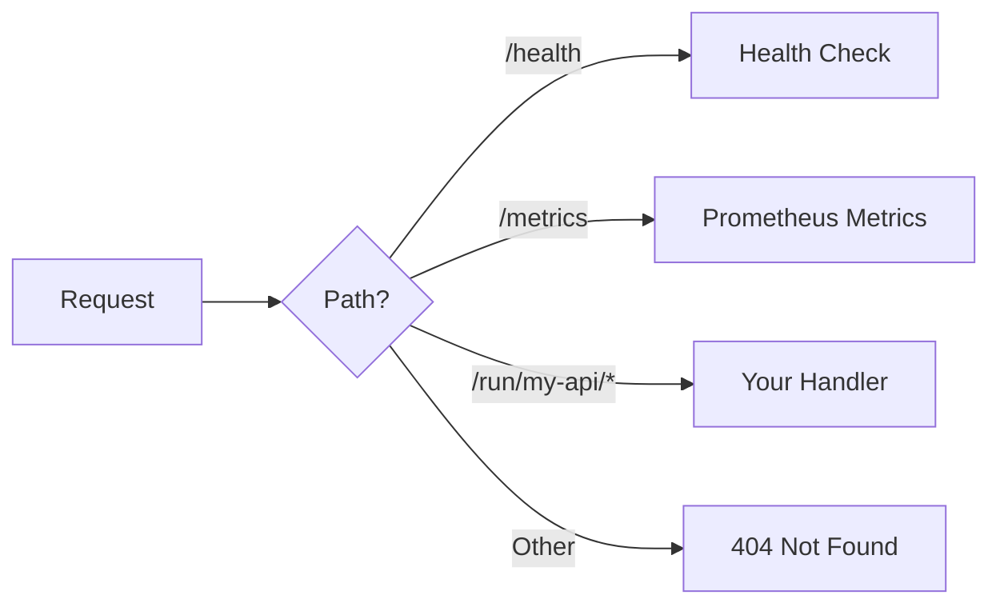

Create an HTTP service with mik-sdk's ergonomic macros and mik's embedded runtime.

## Prerequisites

- **Rust 1.85+** with `wasm32-wasip2` target
- **cargo-component** for building WASM
- **wac-cli** for composition

```bash
# Add WASM target
rustup target add wasm32-wasip2

# Install tools
cargo install cargo-component
cargo install wac-cli
```

## Install mik CLI

**Quick install (recommended):**

```bash
curl -fsSL https://raw.githubusercontent.com/dufeut/mik/main/install.sh | bash
```

This downloads the latest release and sets up shell completions automatically.

**Or via cargo:**

```bash
cargo install mik

# Optional: enable tab completions
mik completions bash > ~/.local/share/bash-completion/completions/mik  # bash
mik completions zsh > ~/.zfunc/_mik                                     # zsh
mik completions fish > ~/.config/fish/completions/mik.fish              # fish
```

## Quick Start

```bash
# Create project
mik new my-api
cd my-api

# Build and run (dev mode with watch + services)
mik build -rc
mik dev
```

Test your API:

```bash
curl http://localhost:3000/run/my-api/
```

## Project Structure

After running `mik new my-api`:

```
my-api/
├── Cargo.toml          # Component package
├── mik.toml            # Project config
├── wit/
│   ├── world.wit       # WIT world definition
│   └── deps/core/      # Core handler interface
├── src/
│   └── lib.rs          # Handler implementation
├── modules/            # Dependencies directory
└── .gitignore
```

## Handler Implementation

The generated `src/lib.rs`:

```rust
#[allow(warnings)]
mod bindings;

use bindings::exports::mik::core::handler::{self, Guest, Response};
use mik_sdk::prelude::*;

routes! {
    GET "/" | "" => home,
    GET "/health" => health,
}

fn home(_req: &Request) -> Response {
    ok!({
        "service": "my-api",
        "message": "Hello from mik!"
    })
}

fn health(_req: &Request) -> Response {
    ok!({ "status": "healthy" })
}
```

## Extending Your Handler

Add more routes with typed path parameters and request bodies:

```rust
#[allow(warnings)]
mod bindings;

use bindings::exports::mik::core::handler::{self, Guest, Response};
use mik_sdk::prelude::*;

// ---- Typed path parameters ----
#[derive(Path)]
struct UserPath {
    id: u32,
}

// ---- Typed request body ----
#[derive(Type)]
struct CreateUserRequest {
    name: String,
    email: Option<String>,
}

// ---- Typed response ----
#[derive(Type)]
struct User {
    id: u32,
    name: String,
}

// ---- Typed query parameters ----
#[derive(Query)]
struct ListQuery {
    #[field(default = 1)]
    page: u32,
    #[field(default = 10)]
    limit: u32,
}

routes! {
    GET "/" | "" => home,
    GET "/health" => health,
    GET "/users" => list_users(query: ListQuery),
    POST "/users" => create_user(body: CreateUserRequest),
    GET "/users/{id}" => get_user(path: UserPath) -> User,
    DELETE "/users/{id}" => delete_user(path: UserPath),
}

fn home(_req: &Request) -> Response {
    ok!({
        "service": "my-api",
        "version": "0.1.0"
    })
}

fn health(_req: &Request) -> Response {
    ok!({ "status": "healthy" })
}

fn list_users(query: ListQuery, _req: &Request) -> Response {
    ok!({
        "users": [
            { "id": 1, "name": "Alice" },
            { "id": 2, "name": "Bob" }
        ],
        "page": query.page,
        "limit": query.limit
    })
}

fn create_user(body: CreateUserRequest, _req: &Request) -> Response {
    guard!(!body.name.is_empty(), 400, "Name is required");

    created!("/users/3", {
        "id": 3,
        "name": body.name
    })
}

fn get_user(path: UserPath, _req: &Request) -> Response {
    ok!({
        "id": path.id,
        "name": "Alice"
    })
}

fn delete_user(_path: UserPath, _req: &Request) -> Response {
    no_content!()
}
```

## Build and Run

### Build Options

```bash
# Development build
mik build

# Release build
mik build -r

# Release + compose with bridge
mik build -rc
```

Output: `dist/my-api-composed.wasm`

### Run the Server

```bash
# Development mode (watch + services)
mik dev

# Or foreground mode (no services)
mik run
```

Output:

```
Starting development server...

Services available at http://127.0.0.1:9919
  KV:      /kv/:key
  SQL:     /sql/query, /sql/execute
  Storage: /storage/*path
  Cron:    /cron

Watching for changes...
Server: http://127.0.0.1:3000
```

## Test Your API

```bash
# Built-in health check
curl http://localhost:3000/health

# Your handler routes (all under /run/<module>/*)
curl http://localhost:3000/run/my-api/
curl http://localhost:3000/run/my-api/users
curl http://localhost:3000/run/my-api/users/1

# Create a user
curl -X POST http://localhost:3000/run/my-api/users \
  -H "Content-Type: application/json" \
  -d '{"name": "Charlie"}'
```

## Routing

All handler routes use the `/run/<module>/*` pattern:



- **Single component**: `/run/<name>/*` - name derived from filename (strips `-composed` suffix)
- **Multi-module**: `/run/<module>/*` - modules loaded from `modules/` directory

## The mik-sdk Macros

### Derive Macros

| Macro              | Purpose                                     |
| ------------------ | ------------------------------------------- |
| `#[derive(Type)]`  | JSON body/response with automatic parsing   |
| `#[derive(Path)]`  | Typed URL path parameters (`{id}`)          |
| `#[derive(Query)]` | Typed query string parameters with defaults |

### Response Macros

| Macro         | Purpose                                  |
| ------------- | ---------------------------------------- |
| `routes!`     | Define routes with typed inputs          |
| `ok!`         | Return JSON with 200                     |
| `created!`    | Return JSON with 201 and Location header |
| `no_content!` | Return 204 No Content                    |
| `error!`      | Return error response                    |
| `guard!`      | Early return if condition fails          |
| `ensure!`     | Unwrap Option/Result or return error     |

## Configuration (mik.toml)

```toml
[project]
name = "my-api"
version = "0.1.0"

[server]
port = 3000

[composition]
http_handler = true  # Auto-downloads bridge
```

## Next Steps

- [Configuration](/guides/configuration) - Full mik.toml reference
- [Reliability](/guides/reliability) - Circuit breaker, rate limiting
- [Scripts](/guides/scripts) - JavaScript orchestration
- [mik-sdk](https://github.com/dufeut/mik-sdk) - Full SDK documentation
