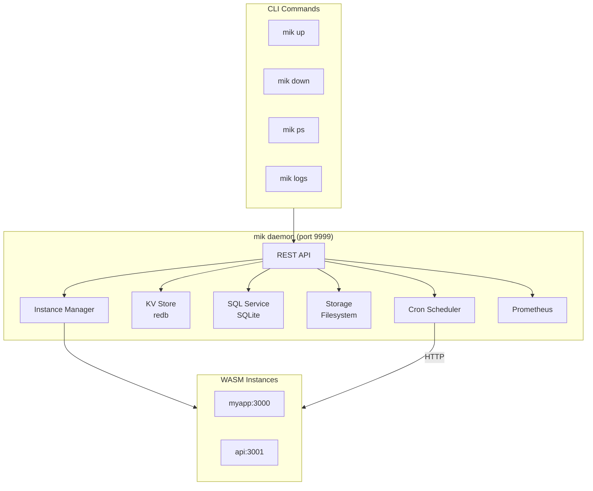

The mik daemon is a background process that manages WASM instances and provides embedded services (KV, SQL, Storage, Cron). It exposes a REST API for programmatic control.

## Operating Modes

mik supports three operating modes, each adding more capabilities:

| Mode | Command | Services | Use Case |
|------|---------|----------|----------|
| **Direct** | `mik run` | None | Development, testing |
| **Daemon** | `mik daemon` + `mik up` | Embedded (SQLite, KV, Storage, Cron) | Dev, small deployments |
| **Sidecar** | Handler + mikcar | Production (Postgres, Redis, S3) | Scale, multi-node |

### Direct Mode

Run a handler in the foreground with no additional services:

```bash
mik run                    # Serves modules/ on port 3000
mik run my-handler.wasm    # Serves single component
```

Handlers can only make outbound HTTP calls. No database, no cron, no storage.

### Daemon Mode (this guide)

The daemon provides a **mini-sidecar** with embedded services:

```
┌─────────────────────────────────────────────────────┐
│  mik daemon (port 9999)                             │
│  ───────────────────────                            │
│  Embedded services:                                 │
│  • KV Store (redb)      • SQL (SQLite)              │
│  • Storage (filesystem) • Cron (scheduled jobs)     │
│                                                     │
│  Good for: dev, prototyping, small deployments      │
└─────────────────────────────────────────────────────┘
         │
         ▼
┌─────────────────────────────────────────────────────┐
│  Handler instances (port 3000, 3001, ...)           │
│  Call daemon services via HTTP                      │
└─────────────────────────────────────────────────────┘
```

Handlers call `http://localhost:9999/kv/...`, `/sql/...`, etc.

### Sidecar Mode (mikcar)

For production at scale, use [mikcar](https://github.com/dufeut/mikcar) instead:

```
┌─────────────────────────────────────────────────────┐
│  mikcar (production sidecar)                        │
│  ───────────────────────────                        │
│  Real infrastructure:                               │
│  • Redis/Valkey         • PostgreSQL/MySQL          │
│  • S3/MinIO             • Real job queues           │
│                                                     │
│  Good for: production, scale, multi-node            │
└─────────────────────────────────────────────────────┘
```

**Same HTTP API, different backends.** Your handler code doesn't change - just swap the sidecar.

---

## Quick Start

```bash
# Start the daemon (default port 9999)
mik daemon

# Start a WASM instance
mik up --name myapp --port 3000

# Check running instances
mik ps

# View logs
mik logs myapp -f

# Stop the instance
mik down myapp
```

## Authentication

API key authentication is optional. Set `MIK_API_KEY` to enable it:

```bash
# Enable authentication
export MIK_API_KEY="your-secret-key"
mik daemon

# All requests must include the API key header
curl -H "X-API-Key: your-secret-key" http://localhost:9999/instances
```

**Exempt endpoints** (always accessible for monitoring):

- `GET /health`
- `GET /metrics`

---

## Instance Management

Manage WASM instances via REST API or CLI.

### REST API

```bash
# List all instances
GET /instances

# Start a new instance
POST /instances
Content-Type: application/json
{
  "name": "myapp",
  "port": 3000,
  "config": "/path/to/mik.toml",
  "auto_restart": true
}

# Get instance details
GET /instances/{name}

# Stop an instance
DELETE /instances/{name}

# Restart an instance
POST /instances/{name}/restart

# Get instance logs
GET /instances/{name}/logs?lines=100
```

### CLI Commands

```bash
mik up [--name NAME] [--port PORT] [--watch]   # Start instance
mik down [NAME]                                 # Stop instance
mik ps                                          # List instances
mik logs [NAME] [-f] [-n LINES]                # View logs
```

### Example: Start and Monitor

```bash
# Start with hot reload for development
mik up --name dev --port 3000 --watch

# Check status
curl http://localhost:9999/instances/dev

# Response:
{
  "name": "dev",
  "port": 3000,
  "status": "running",
  "pid": 12345,
  "uptime": "2h 15m",
  "config": "/home/user/myapp/mik.toml"
}
```

---

## KV Store

Redis-like key-value storage backed by redb. Supports TTL for automatic expiration.

```bash
# Set a value (with optional TTL in seconds)
PUT /kv/{key}
Content-Type: application/json
{"value": "hello world", "ttl": 3600}

# Get a value
GET /kv/{key}
# Response: {"key": "mykey", "value": "hello world"}

# Delete a key
DELETE /kv/{key}

# List keys (with optional prefix filter)
GET /kv?prefix=user:
# Response: {"keys": ["user:1", "user:2", "user:3"]}
```

### Example: Session Storage

```bash
# Store session with 1 hour TTL
curl -X PUT http://localhost:9999/kv/session:abc123 \
  -H "Content-Type: application/json" \
  -d '{"value": "{\"user_id\": 42, \"role\": \"admin\"}", "ttl": 3600}'

# Retrieve session
curl http://localhost:9999/kv/session:abc123

# List all sessions
curl "http://localhost:9999/kv?prefix=session:"
```

---

## SQL Database

Embedded SQLite database with full SQL support. Foreign keys are enabled by default.

```bash
# Execute DDL/DML (CREATE, INSERT, UPDATE, DELETE)
POST /sql/execute
Content-Type: application/json
{"sql": "CREATE TABLE users (id INTEGER PRIMARY KEY, name TEXT NOT NULL)"}

# Query data (SELECT)
POST /sql/query
Content-Type: application/json
{"sql": "SELECT * FROM users WHERE id = ?", "params": [1]}

# Response:
{
  "columns": ["id", "name"],
  "rows": [{"id": 1, "name": "Alice"}],
  "rows_affected": 0
}
```

### Batch Operations (Atomic)

Batch executes multiple statements in a **single transaction**. If any statement fails, **all changes are rolled back**.

```bash
POST /sql/batch
Content-Type: application/json
{
  "statements": [
    {"sql": "INSERT INTO users (name) VALUES (?)", "params": ["Alice"]},
    {"sql": "INSERT INTO users (name) VALUES (?)", "params": ["Bob"]},
    {"sql": "UPDATE users SET name = ? WHERE id = ?", "params": ["Charlie", 1]}
  ]
}

# Response:
{
  "results": [
    {"rows_affected": 1},
    {"rows_affected": 1},
    {"rows_affected": 1}
  ],
  "total_affected": 3
}
```

### Example: Create Schema

```bash
# Create tables
curl -X POST http://localhost:9999/sql/execute \
  -H "Content-Type: application/json" \
  -d '{"sql": "CREATE TABLE IF NOT EXISTS posts (id INTEGER PRIMARY KEY, title TEXT, user_id INTEGER REFERENCES users(id))"}'

# Insert with foreign key
curl -X POST http://localhost:9999/sql/execute \
  -H "Content-Type: application/json" \
  -d '{"sql": "INSERT INTO posts (title, user_id) VALUES (?, ?)", "params": ["Hello World", 1]}'

# Query with join
curl -X POST http://localhost:9999/sql/query \
  -H "Content-Type: application/json" \
  -d '{"sql": "SELECT p.title, u.name FROM posts p JOIN users u ON p.user_id = u.id"}'
```

---

## Object Storage

S3-like object storage backed by the filesystem. Supports any file type with automatic content-type detection.

```bash
# Upload a file
PUT /storage/{path}
Content-Type: application/octet-stream
<binary data>

# Download a file
GET /storage/{path}

# Delete a file
DELETE /storage/{path}

# Get metadata (size, content-type, timestamps)
HEAD /storage/{path}

# List objects (with optional prefix)
GET /storage?prefix=images/
```

### Example: File Upload

```bash
# Upload an image
curl -X PUT http://localhost:9999/storage/images/logo.png \
  -H "Content-Type: image/png" \
  --data-binary @logo.png

# Get metadata
curl -I http://localhost:9999/storage/images/logo.png
# Headers: Content-Type, Content-Length, Last-Modified, ETag

# List all images
curl "http://localhost:9999/storage?prefix=images/"
# Response: {"objects": [{"path": "images/logo.png", "size": 12345, ...}]}

# Download
curl http://localhost:9999/storage/images/logo.png -o downloaded.png
```

---

## Cron Scheduler

Schedule recurring jobs using cron expressions. Jobs call WASM module endpoints via HTTP.

### Endpoints

```bash
# List all jobs
GET /cron

# Create a new job
POST /cron
Content-Type: application/json
{
  "name": "cleanup",
  "cron": "0 0 * * * * *",
  "module": "cleanup.wasm",
  "method": "POST",
  "path": "/run",
  "port": 3000,
  "enabled": true
}

# Get job details
GET /cron/{name}

# Update job (pause/resume)
PATCH /cron/{name}
Content-Type: application/json
{"enabled": false}

# Delete a job
DELETE /cron/{name}

# Manually trigger a job
POST /cron/{name}/trigger

# Get execution history
GET /cron/{name}/history
```

### Cron Expression Format

Uses 7-field format: `sec min hour day month weekday year`

```
0 0 0 * * * *      # Daily at midnight
0 */5 * * * * *    # Every 5 minutes
0 0 12 * * MON *   # Every Monday at noon
0 30 9 1 * * *     # 9:30 AM on the 1st of each month
```

### Example: Create a Cleanup Job

```bash
# Create job that runs every hour
curl -X POST http://localhost:9999/cron \
  -H "Content-Type: application/json" \
  -d '{
    "name": "hourly-cleanup",
    "cron": "0 0 * * * * *",
    "module": "cleanup.wasm",
    "method": "POST",
    "path": "/cleanup",
    "port": 3000,
    "enabled": true
  }'

# Pause the job
curl -X PATCH http://localhost:9999/cron/hourly-cleanup \
  -H "Content-Type: application/json" \
  -d '{"enabled": false}'

# Trigger manually for testing
curl -X POST http://localhost:9999/cron/hourly-cleanup/trigger

# Check execution history
curl http://localhost:9999/cron/hourly-cleanup/history
# Response:
{
  "job_name": "hourly-cleanup",
  "executions": [
    {
      "id": "abc-123",
      "started_at": "2025-01-15T10:00:00Z",
      "completed_at": "2025-01-15T10:00:01Z",
      "duration_ms": 1250,
      "success": true,
      "manual": true
    }
  ]
}
```

### Jobs from mik.toml

Jobs defined in `mik.toml` are automatically registered when an instance starts:

```toml
[[schedules]]
name = "daily-report"
cron = "0 0 8 * * * *"
module = "reports.wasm"
method = "POST"
path = "/generate"
```

---

## Prometheus Metrics

```bash
GET /metrics
```

Available metrics:

| Metric                                | Description                            |
| ------------------------------------- | -------------------------------------- |
| `mik_http_requests_total`             | Total HTTP requests by path and status |
| `mik_http_request_duration_seconds`   | Request latency histogram              |
| `mik_instance_count`                  | Running/stopped/crashed instances      |
| `mik_instance_uptime_seconds`         | Instance uptime                        |
| `mik_kv_operations_total`             | KV operations by type                  |
| `mik_sql_queries_total`               | SQL queries by type                    |
| `mik_storage_operations_total`        | Storage operations by type             |
| `mik_cron_executions_total`           | Cron job executions                    |
| `mik_cron_execution_duration_seconds` | Cron job duration                      |

---

## System Endpoints

```bash
# Health check (always returns 200 if daemon is running)
GET /health
# Response: {"status": "healthy", "uptime": "running"}

# Version info
GET /version
# Response: {"version": "0.1.0", "build": "release"}
```

---

## Architecture



---

## Summary

The daemon is a **mini-sidecar** - embedded services for development and small deployments. For production at scale, swap to [mikcar](https://github.com/dufeut/mikcar) with the same API but real infrastructure backends.

See [Operating Modes](#operating-modes) for the full comparison.
