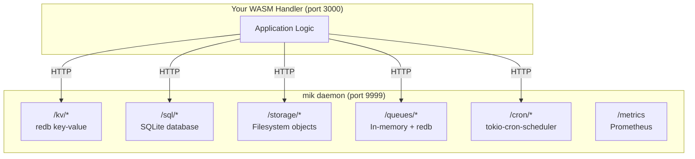

The mik daemon provides embedded services that WASM handlers can access via HTTP. This eliminates the need for external sidecars during development and simple deployments.

## Quick Start

```bash
# Start the daemon
mik daemon --port 9999

# Start your WASM instance
mik up --name myapp --port 3000

# Your WASM handler can now call:
# http://127.0.0.1:9999/kv/...
# http://127.0.0.1:9999/sql/...
# http://127.0.0.1:9999/storage/...
# etc.
```

## Available Services

| Service | Endpoint | Description |
|---------|----------|-------------|
| KV Store | `/kv/*` | Key-value storage with TTL support |
| SQL | `/sql/*` | Embedded SQLite database |
| Storage | `/storage/*` | S3-like object storage |
| Queue | `/queues/*` | Message queues and pub/sub |
| Cron | `/cron/*` | Scheduled job management |
| Metrics | `/metrics` | Prometheus metrics |

## KV Store

Redis-like key-value storage backed by redb.

```bash
# Set a value
PUT /kv/{key}
Content-Type: application/json
{"value": "hello", "ttl": 3600}

# Get a value
GET /kv/{key}
# Response: {"key": "mykey", "value": "hello"}

# Delete a key
DELETE /kv/{key}

# List keys
GET /kv?prefix=user:
```

### From WASM (Rust)

```rust
use mik_sdk::http_client;

// Set value
let body = r#"{"value": "hello", "ttl": 3600}"#;
http_client::put("http://127.0.0.1:9999/kv/mykey", body.as_bytes());

// Get value
let response = http_client::get("http://127.0.0.1:9999/kv/mykey");
```

## SQL Database

Embedded SQLite database for relational data.

```bash
# Execute DDL/DML (CREATE, INSERT, UPDATE, DELETE)
POST /sql/execute
Content-Type: application/json
{"sql": "CREATE TABLE users (id INTEGER PRIMARY KEY, name TEXT)"}

# Query data
POST /sql/query
Content-Type: application/json
{"sql": "SELECT * FROM users WHERE id = ?", "params": [1]}

# Batch operations
POST /sql/batch
Content-Type: application/json
{"statements": [
  {"sql": "INSERT INTO users (name) VALUES (?)", "params": ["Alice"]},
  {"sql": "INSERT INTO users (name) VALUES (?)", "params": ["Bob"]}
]}
```

## Object Storage

S3-like storage backed by the filesystem.

```bash
# Upload file
PUT /storage/{path}
Content-Type: application/octet-stream
<binary data>

# Download file
GET /storage/{path}

# Delete file
DELETE /storage/{path}

# Get metadata
HEAD /storage/{path}

# List objects
GET /storage?prefix=images/
```

## Message Queues

In-memory message queues with persistence.

```bash
# Push message
POST /queues/{name}/push
Content-Type: application/json
{"payload": {"task": "process", "id": 123}}

# Pop message
POST /queues/{name}/pop
# Response: {"message": {"id": "...", "payload": {...}}}

# Peek without removing
GET /queues/{name}/peek

# Get queue info
GET /queues/{name}

# Publish to topic (pub/sub)
POST /topics/{name}/publish
{"payload": {"event": "user.created"}}
```

## Cron Scheduler

Schedule WASM jobs with cron expressions.

```bash
# List all jobs
GET /cron

# Get job details
GET /cron/{name}

# Manually trigger a job
POST /cron/{name}/trigger

# Get execution history
GET /cron/{name}/history
```

### Cron Expression Format

Uses 7-field format: `sec min hour day month weekday year`

```
0 0 0 * * * *     # Daily at midnight
0 */5 * * * * *   # Every 5 minutes
0 0 12 * * MON *  # Every Monday at noon
```

## Prometheus Metrics

```bash
GET /metrics
# Response: Prometheus text format

# Metrics include:
# mik_http_requests_total
# mik_http_request_duration_seconds
# mik_kv_operations_total
# mik_sql_queries_total
# mik_storage_operations_total
# mik_queue_operations_total
# mik_cron_executions_total
```

## CLI Commands

```bash
# Daemon management
mik daemon [--port 9999]   # Start daemon
mik ps                     # List instances
mik logs [name] [-f]       # View logs

# Instance lifecycle
mik up [--name] [--port]   # Start instance
mik down [name]            # Stop instance
```

## Example: Full Integration Test

See `examples/daemon-test/` for a complete WASM handler that tests all daemon services:

```rust
use mik_sdk::http_client;

// Test KV
let body = r#"{"value": "test", "ttl": 3600}"#;
http_client::put("http://127.0.0.1:9999/kv/test-key", body.as_bytes());
let response = http_client::get("http://127.0.0.1:9999/kv/test-key");

// Test SQL
let sql = r#"{"sql": "SELECT 1 as num"}"#;
http_client::post("http://127.0.0.1:9999/sql/query", sql.as_bytes());

// Test Storage
http_client::put("http://127.0.0.1:9999/storage/test.txt", b"hello");
http_client::get("http://127.0.0.1:9999/storage/test.txt");

// Test Queue
let msg = r#"{"payload": {"test": true}}"#;
http_client::post("http://127.0.0.1:9999/queues/test/push", msg.as_bytes());
http_client::post("http://127.0.0.1:9999/queues/test/pop", &[]);
```

## Architecture



## When to Use

**Use embedded daemon services for:**
- Local development
- Simple deployments
- Single-node applications
- Prototyping

**Use external sidecars (mikcar) for:**
- Production at scale
- Multi-node deployments
- When you need Redis/Postgres/S3 specifically
- When you need replication/clustering
