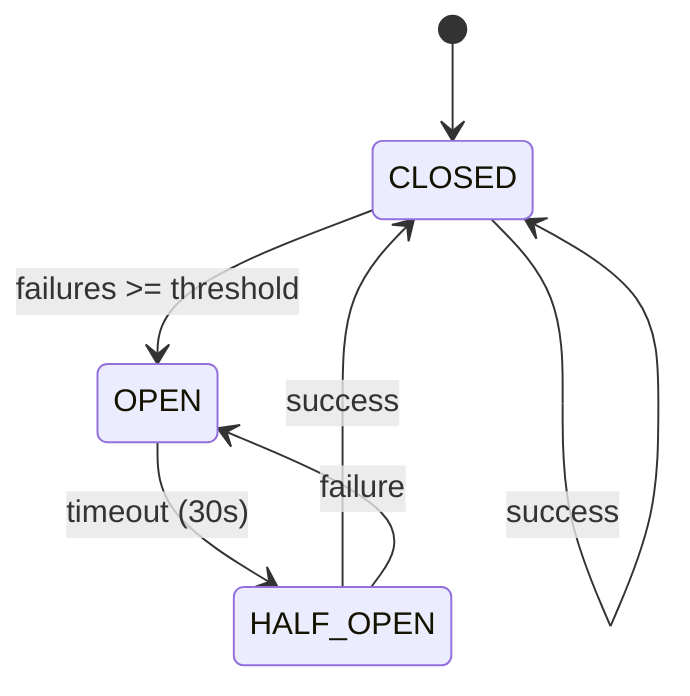
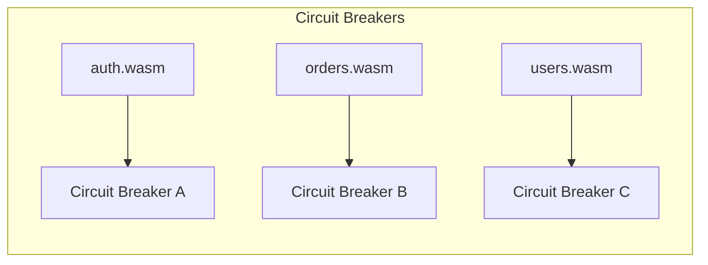
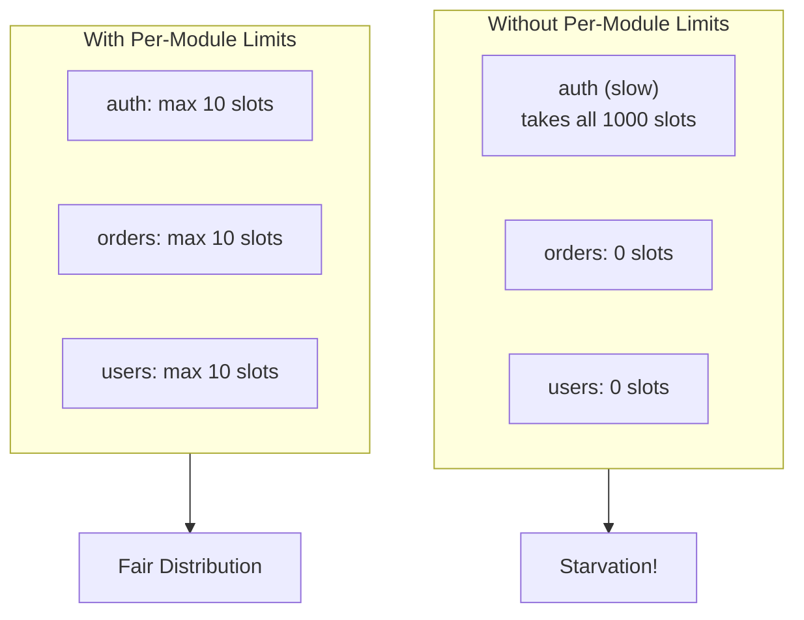

mik includes production-ready reliability features out of the box.

## Circuit Breaker

Prevents cascading failures by stopping requests to failing handlers.

### How It Works



1. **Closed** - Normal operation, requests pass through
2. **Open** - Handler is failing, requests rejected immediately
3. **Half-Open** - Testing if handler recovered

### Configuration

Circuit breaker is enabled by default with sensible defaults:

| Setting | Default | Description |
|---------|---------|-------------|
| Failure threshold | 5 | Failures before opening |
| Recovery timeout | 30s | Time before testing recovery |
| Half-open max requests | 3 | Test requests in half-open |

### Response When Open

```http
HTTP/1.1 503 Service Unavailable
Retry-After: 30
Content-Type: application/json

{
  "type": "urn:mik:error:circuit-open",
  "title": "Service Unavailable",
  "status": 503,
  "detail": "Circuit breaker is open for module: auth"
}
```

### Per-Module Isolation

Each WASM module has its own circuit breaker:



A failure in `auth.wasm` doesn't affect `orders.wasm`.

## Rate Limiting

Prevents resource exhaustion from too many requests.

### Two Levels

1. **Global limit** - Max concurrent requests across all handlers
2. **Per-module limit** - Max concurrent requests per handler

### Configuration

```toml
[server]
max_concurrent_requests = 1000    # Global limit
max_per_module_requests = 10      # Per-handler limit
```

### Response When Limited

```http
HTTP/1.1 503 Service Unavailable
Retry-After: 1
Content-Type: application/json

{
  "type": "urn:mik:error:rate-limited",
  "title": "Service Unavailable",
  "status": 503,
  "detail": "Module auth is overloaded"
}
```

### Why Per-Module Limits?

Prevents a slow handler from consuming all resources:



## LRU Cache

Caches compiled WASM modules for faster cold starts.

### Configuration

```toml
[server]
cache_size = 100              # Max cached modules
max_cache_mb = 256            # Max cache size in MB
```

### How It Works

1. First request compiles WASM → caches result
2. Subsequent requests use cached module
3. LRU eviction when cache is full

### Cache Stats

Available via health endpoint:

```bash
curl http://localhost:3000/health
```

```json
{
  "status": "ready",
  "cache_size": 5,
  "cache_capacity": 100,
  "cache_bytes": 1048576,
  "total_requests": 1000
}
```

## Execution Timeout

Prevents runaway handlers from blocking resources.

### Configuration

```toml
[server]
execution_timeout_secs = 30    # Max execution time per request
```

### Response When Timeout

```http
HTTP/1.1 504 Gateway Timeout
Content-Type: application/json

{
  "type": "urn:mik:error:timeout",
  "title": "Gateway Timeout",
  "status": 504,
  "detail": "Handler execution timed out"
}
```

## Body Size Limit

Prevents memory exhaustion from large request bodies.

### Configuration

```toml
[server]
max_body_size_mb = 10    # Max body size in MB
```

### Response When Exceeded

```http
HTTP/1.1 413 Payload Too Large
Content-Type: application/json

{
  "type": "urn:mik:error:payload-too-large",
  "title": "Payload Too Large",
  "status": 413,
  "detail": "Request body exceeds 10MB limit"
}
```

## Graceful Shutdown

Handles SIGTERM/SIGINT signals gracefully:

1. Stops accepting new connections
2. Waits for in-flight requests to complete
3. Closes connections cleanly
4. Exits with code 0

```bash
# Send shutdown signal (Ctrl+C or)
kill -TERM $(pgrep mik)

# Logs:
# Received shutdown signal, draining connections...
# All connections drained, shutting down
```

## Health Check

Built-in health endpoint for load balancers:

```bash
curl http://localhost:3000/health
```

```json
{
  "status": "ready",
  "timestamp": "2025-01-01T00:00:00Z",
  "cache_size": 5,
  "cache_capacity": 100,
  "total_requests": 1000
}
```

## Best Practices

1. **Monitor circuit breaker state** - Log when circuits open/close
2. **Tune per-module limits** - Based on handler complexity
3. **Set appropriate timeouts** - Balance user experience vs resource usage
4. **Use health checks** - For load balancer integration
5. **Size cache appropriately** - Based on module count and sizes
