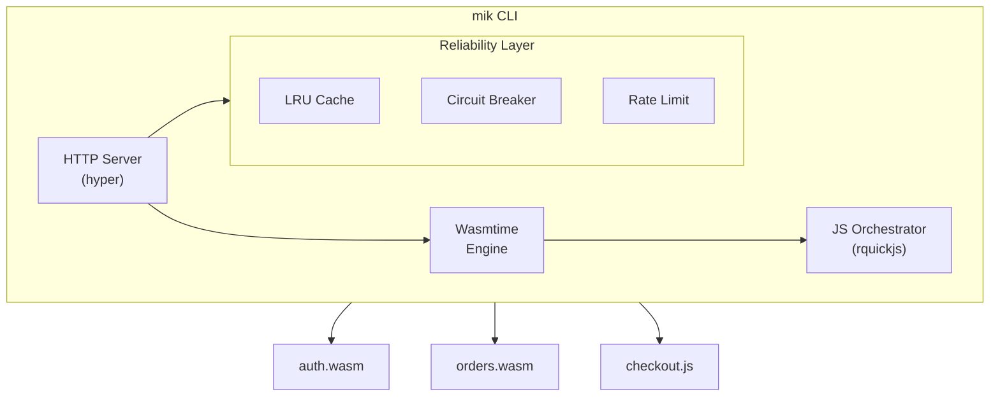

**Build, run, and deploy WASI HTTP handlers**

mik is a batteries-included CLI for WASI HTTP projects. It handles building, composition, and running your WASM HTTP handlers with reliability features like circuit breakers, rate limiting, and JavaScript orchestration.

> **Note:** mik is an experimental project for learning WASI P2 and the component model. Not yet battle-tested for production.

## Why mik?

| Challenge                   | mik Solution                            |
| --------------------------- | --------------------------------------- |
| Complex WASI runtimes       | Single binary with embedded runtime     |
| No built-in reliability     | Circuit breaker, rate limiting, caching |
| Orchestration requires Rust | JavaScript/TypeScript via rquickjs      |
| Multi-module scenarios      | Route multiple handlers from one server |

## Key Features

- **Single Binary** - `mik` CLI includes the embedded runtime
- **Reliability** - Circuit breaker, rate limiting, graceful shutdown
- **LRU Cache** - Byte-aware module caching with configurable limits
- **JavaScript Orchestration** - Compose multiple WASM handlers via JS/TS scripts
- **Static Files** - Optional static file serving with MIME detection
- **Prometheus Metrics** - Built-in `/metrics` endpoint
- **Gzip Compression** - Automatic compression for large responses

## Quick Start

```bash
# Install
cargo install mik

# Create project
mik new my-api
cd my-api

# Build and run
mik build -rc
mik run
```

Test: `curl http://localhost:3000/run/my-api/`

## Architecture



## Runtime Modes

### Multi-Module Mode

Run multiple handlers from a directory:

```bash
mik run   # Uses mik.toml configuration
```

```toml
[server]
modules = "modules/"
```

| Route           | Handler                      |
| --------------- | ---------------------------- |
| `/run/auth/*`   | `modules/auth.wasm`          |
| `/run/users/*`  | `modules/users.wasm`         |
| `/run/orders/*` | `modules/orders.wasm`        |
| `/static/*`     | Static files (if configured) |
| `/health`       | Health check                 |
| `/metrics`      | Prometheus metrics           |

### Single Component Mode

Run a single component:

```bash
mik run dist/my-api-composed.wasm
```

Routes: `/run/my-api/*` -> component (name derived from filename)

## The mik-sdk

Write handlers with typed, ergonomic Rust macros:

```rust
#[allow(warnings)]
mod bindings;

use bindings::exports::mik::core::handler::{self, Guest, Response};
use mik_sdk::prelude::*;

#[derive(Path)]
struct UserPath {
    id: u32,
}

routes! {
    GET "/" | "" => home,
    GET "/users/{id}" => get_user(path: UserPath),
}

fn home(_req: &Request) -> Response {
    ok!({
        "message": "Hello from mik!",
        "version": "0.1.0"
    })
}

fn get_user(path: UserPath, _req: &Request) -> Response {
    ok!({
        "id": path.id,
        "name": "Alice"
    })
}
```

## Documentation

- [Getting Started](/getting-started) - Build your first handler
- [Configuration](/guides/configuration) - mik.toml reference
- [Scripts](/guides/scripts) - JavaScript orchestration
- [Reliability](/guides/reliability) - Circuit breaker, rate limiting
- [CLI Reference](/reference/cli) - Command line tools
- [Architecture](/reference/architecture) - Technical design

## Requirements

- Rust 1.85+
- `cargo-component` for building WASM
- `wac-cli` for composition

## License

MIT
