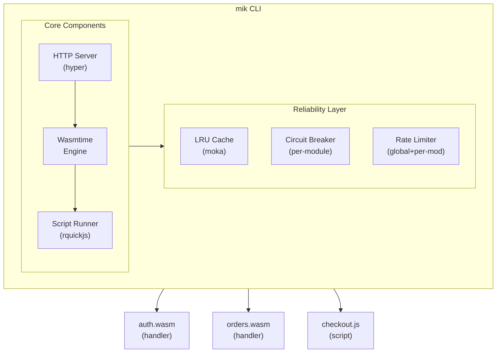
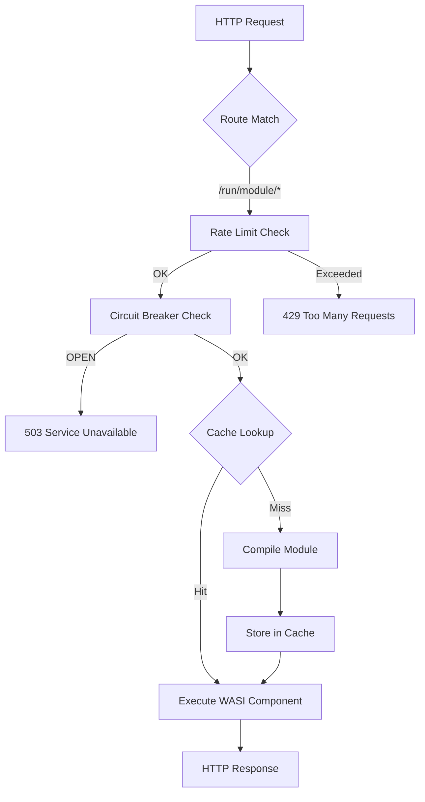
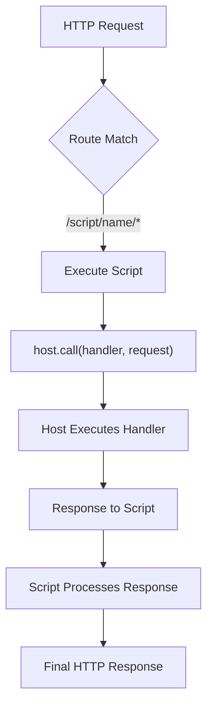
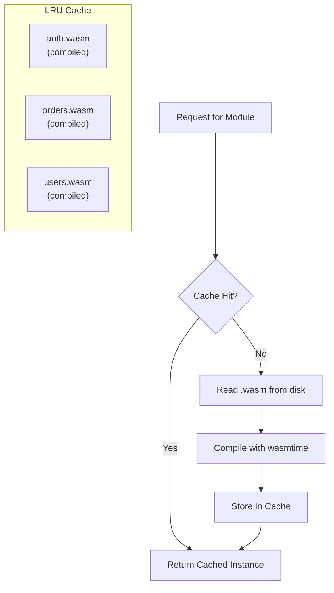
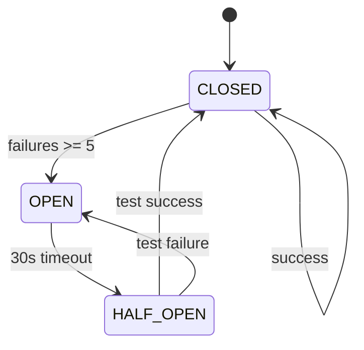

mik is a WASI HTTP runtime with JavaScript orchestration capabilities, packaged as a single CLI.

## System Overview



## Components

| Component | Technology | Purpose |
|-----------|------------|---------|
| HTTP Server | hyper 1.x | Async HTTP/1.1, graceful shutdown |
| WASM Runtime | wasmtime 40 | WASI Preview 2 execution |
| Script Runner | rquickjs | JavaScript orchestration |
| Cache | moka | LRU module caching |
| Circuit Breaker | custom | Failure isolation |
| Rate Limiter | governor | Request throttling |

## Request Flow

### WASM Handler



### Script (Orchestration)



## Module Loading



## Circuit Breaker



## Routing

All handler routes use `/run/<module>/*` pattern:

| Route | Handler |
|-------|---------|
| `/run/auth/*` | `modules/auth.wasm` |
| `/run/users/*` | `modules/users.wasm` |
| `/script/checkout/*` | `scripts/checkout.js` |
| `/health` | Built-in health check |
| `/metrics` | Prometheus metrics |

## Project Structure

```
mik/
├── src/
│   ├── commands/         # CLI commands (new, build, run, etc.)
│   ├── runtime/          # WASM runtime, AOT cache
│   ├── daemon/           # Background services (KV, SQL, etc.)
│   └── manifest.rs       # mik.toml parsing
├── docs/                 # Documentation (Astro)
└── examples/             # Example projects
```

## Related Pages

- [Sidecar Communication](/reference/sidecars) - How handlers talk to infrastructure
- [Security Model](/reference/security) - Capability-based security
- [Reliability Features](/guides/reliability) - Circuit breakers, rate limiting
