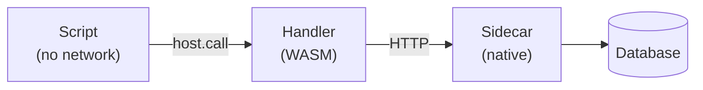

mik uses a layered capability model to isolate WASM modules from infrastructure.

## Capability Layers

| Layer        | Network Access            | Purpose                 |
| ------------ | ------------------------- | ----------------------- |
| **Scripts**  | None - `host.call()` only | Orchestration           |
| **Handlers** | HTTP to sidecars only     | Business logic          |
| **Sidecars** | Native (full access)      | Infrastructure adapters |



## Allowed Capabilities

These capabilities are granted to WASM handlers:

| Capability       | WASI Interface                | Rationale                       |
| ---------------- | ----------------------------- | ------------------------------- |
| Wall Clock       | `wasi:clocks/wall-clock`      | Timestamps, TTL calculations    |
| Monotonic Clock  | `wasi:clocks/monotonic-clock` | Performance timing              |
| Random           | `wasi:random/random`          | UUIDs, cryptographic operations |
| Logging (stderr) | `wasi:cli/stderr`             | Observability                   |
| Environment      | `wasi:cli/environment`        | Configuration injection         |
| HTTP Client      | `wasi:http/outgoing-handler`  | Sidecar communication           |

## Denied Capabilities

These are **never granted**:

| Capability              | Reason                                   |
| ----------------------- | ---------------------------------------- |
| Filesystem access       | Breaks isolation, data exfiltration risk |
| Raw sockets             | Bypasses HTTP policy enforcement         |
| Process spawning        | Sandbox escape                           |
| Direct database drivers | Credential exposure                      |

## Runtime Protections

| Threat                | Mitigation                              |
| --------------------- | --------------------------------------- |
| Path traversal        | Input sanitization, path validation     |
| DoS via large bodies  | Configurable body size limits           |
| DoS via slow handlers | Execution timeouts, circuit breaker     |
| Resource exhaustion   | Rate limiting (global + per-module)     |
| Unbounded allocations | LRU cache with byte limits              |
| Handler failures      | Circuit breaker with half-open recovery |

## Configuration

```toml
[server]
# Limit request body size
max_body_size_mb = 10

# Limit execution time
execution_timeout_secs = 30

# Rate limiting
max_concurrent_requests = 1000   # Global limit
max_per_module_requests = 10     # Per-handler limit

# Restrict outgoing HTTP
http_allowed = ["*.internal.example.com"]
```

## HTTP Allow List

Control which hosts handlers can reach:

```toml
# Disable all outgoing HTTP (most restrictive)
http_allowed = []

# Allow specific hosts
http_allowed = ["api.example.com", "db-sidecar"]

# Wildcard subdomains
http_allowed = ["*.internal.example.com"]

# Allow all (least restrictive)
http_allowed = ["*"]
```

## Why This Model?

### Scripts Can't Make Network Requests

Scripts can only call handlers via `host.call()`. This prevents:

- Scripts from bypassing handler logic
- Direct database access from orchestration layer
- Credential leakage through script injection

### Handlers Only See HTTP

Handlers use `wasi:http/outgoing-handler` to call sidecars. Benefits:

- No database drivers in WASM (smaller binaries)
- Credentials stay in sidecars
- All requests are auditable
- Policy enforcement at sidecar layer

### Sidecars Hold Credentials

Sidecars are native processes with full access. They:

- Own database connection pools
- Enforce authentication and rate limits
- Translate HTTP to infrastructure protocols
- Can implement caching and retries

## Portability

This security model preserves handler portability. The same `.wasm` file works on any WASI Preview 2 runtime—handlers don't know they're running on mik, they just make HTTP requests.
